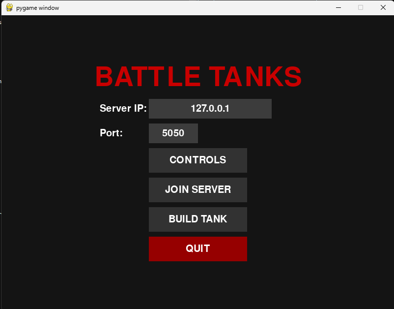

# **CMPT 371 A3 Socket Programming `Battle Tanks`**

**Course:** CMPT 371 \- Data Communications & Networking  
**Instructor:** Mirza Zaeem Baig  
**Semester:** Spring 2026 

## **Group Members**

| Name | Student ID | Email |
| :---- | :---- | :---- |
| Lucian Chen | 301588981 | lca193@sfu.ca |
| Tristan Liu | 301567578 | tristan_liu@sfu.ca |

## **1\. Project Overview & Description**

This project is a multplayer tank battle game, where users can build their own tanks and participate in a battle royale style battle using Python's Socket API (TCP). Players can all join the same lobby then start the game, fighting against each other in real time with tanks they customize beforehand. The server handles the game logic, game state calculations, and damage checks to prevent cheating. This renders the client essentially as a glorified television, in which I implemented LERP (Linear Interpolation), and client-side prediction in order for a smoother experience for the player.

## **2\. System Limitations & Edge Cases**
As required by the project specifications, we have identified and handled (or defined) the following limitations and potential issues within our application scope:

* **Handling Multiple Clients Concurrently**
    * *Solution:* We utilized Python's threading module, with each client connecting causing another thread to be opened. They will be assigned a userID that is sent to them via a packet with "type":"ACCEPTED" and can then track their own positions in a fog of war style map
    * *Limitation:* Thread creation is limited by system resources, with my PC being limited to around 500 threads. This however, should never be an issue as our map isn't large enough to support 500 players and would require the user to edit config.json
* **TCP Stream Buffering**
    * *Solution:* TCP is a continuous byte stream, so not everything arrives at once, and some messages can be mashed together if sent too fast. As such, we implemented a fix on both client and server end by just using bracket-counting to seperate the messages.
        * *Bracket-Counting:* Essentially, every open bracket adds 1 to the bracket count, and every closed bracket subtracts one. Upon hitting a closed bracket, we check if the count is 0. If it is, then we've reached a full message and pop it out to process.
* **Input Validation & Security**
    * *Limitation:* The client side uses many try/excepts enclosed within each other to capture every possible error. As we don't trust users to not intercept packets and send fake results over, all math is done of server side. However, malicious users can still intercept the message and delete the content, as .get() can not retrieve a NoneType.
* **Victory Checks**
    * *Limitation:* Our victory check works by checking if there's only one player left after a player death or a player disconnecting either by using ESC or by using a system interrupt to forcefully shut down their client. However, a crash can still occur if a player manages to leave between the check of len(active_players) == 1 succeeding and the victory message being sent out. This however, should also not be a major issue, as with the last player leaving the server, the server should close either way
* **Bad Join Times**
    * As this is a battle royale and we don't want people to just rejoin the server after dying to cheese their death, we have made it impossible to join the game after the game has started. As such, when a player connects to a running server, they will be prompted to press ESC to leave

## **3\. Video Demo**
[**TODO**]

## **4\. Prerequisites (Fresh Environment)**

To run this project you need:
* **Python 3.10** or higher
* **Pygame Library**: This is required for the client-side GUI and rendering
* **Standard Libraries**: Uses `socket`, `threading`, `json`, `math`, and `pathlib` which are all included within Python

[IMPORTANT]
**External Library Installation**
Before running the client, you must install Pygame via pip:
```Bash
pip install pygame
```

## **1\. Step-By-Step Run Guide**
### **Step 1: Start the Server**
Open your terminal and navigate to the project folder. The server binds to 0.0.0.0 on port 5050. It will then display both the IP you can connect to and the IP other users on the local area network can connect on
```bash
python src/server.py

# Console output:
# ==================================================
# [ONLINE] Server listening on: 0.0.0.0:5050
# [CONNECT] Friends on your Wi-Fi should use: 172.18.32.1
# [CONNECT] You (locally) can use: 127.0.0.1
# ==================================================
#
# [RUNNING] Game logic thread started

```

### **Step 2: Connect Players**

Open a **new** terminal window (unless you attached & to the end of your previous command). Run the client script to start the first client.
```bash
python src/client.py

# Console output: A ton of jargon about how pkg_resources is deprecated as an API
# A pygame window will open; below is an example
```


### **Step 3: Building Your Tanks**

This step is not neccesary, if you don't customize your tanks, you will be loaded into the match with standard gear.

1. Press the most bottom gray button labeled "BUILD TANK"
2. Within, you will see the sections of Tracks, Armor, Sights, and Barrels
3. Choose your parts in a carousel style by clicking the left and right arrows next to the part names
4. You can see your stats via the stat bars implemented on the bottom (Blue and Purple are special colours)
5. Once you are satisfied with your tank, press the button labeled "BACK TO MENU"

### **Step 4: Joining the Server**

1. If you are on the same machine as the server, just press "JOIN SERVER". 
    a) If the server is not running at this point, an error message will appear: Connection failed: [WinError 10061] No connection could be made because the target machine actively refused it
2. If you are on another machine on LAN, input the IP given to you by the server in the IP box then press "JOIN SERVER"

### **Step 5: Gameplay**

1. To start the game, press the ENTER key on your keyboard, no other players can join after this, so make sure to complete Step 4 from above for all clients before this step.
2. To move a tank forward, press W. To move it backwards relative to its rotation, press S.
3. To turn a tank, press counter clockwise and clockwise respectively.
4. To shoot a shell, press SPACEBAR (There is a delay between each shot to make sure players can't just spam bullets everywhere)
5. The terrain type and effects are as follow
    a) Black: Stone, it stops bullets and the player, you can not go through it
    b) Brown: Mud, it slows you down a bit
    c) Blue: Water, it halves your movement speed
    d) Green: Grass, no effect
    e) Grey: Gravel, no effect
6. Go around the map and find other players to shoot them until they poof out of existence. Dead clients get a "GAME OVER" screen, last player standing gets a "VICTORY" screen.
7. If you entered by yourself or just want to give up, press ESC to leave the match. The server will be closed if there are no players left

## **5\. Technical Protocol Details (JSON over TCP)**

We designed a custom application layer protocol for data exchange using JSON over TCP
* **Message Format:** `{"type": <string>, "content": <data>}`
    * content is optional for certain types such as INPROGRESS
* **Handshake Phase:** 
    * Client sends: `{"type": "CONNECT", "content": selected_parts <another json>}`
        * example: {
  "type": "CONNECT",
  "content": {
    "tracks": "Standard Tracks",
    "armor": "Standard Armor",
    "sights": "Standard Sight",
    "barrels": "Standard Barrel"
  }
}
    * Server responds: `{"type": "ACCEPTED", "id": player_id <int>}`
        * example: {"type": "ACCEPTED", "id": 1}
        * both selected_parts and player_id are variables
        * selected_parts are your tank parts
        * player_id lets users know what their ID is to look for later in the UPDATE phase
* **Gameplay Phase:**
    * Client sends: `{"type": "ACTION", "content": {"keys": ["W", "A", "SPACE"]}}`
    * Server does math on a json they have of all entities (entities are players and shells)
    * Server sends update message every game tick to all players: `{"type": "UPDATE", "players": [{"id": 1, "pos": [12.5, 7.2], "rot": 45.0, "hp": 100.0}], "shells": [{"id": 98234, "pos": [13.2, 8.1], "type": "Standard Barrel"}]}`
        * Note that the server does not send a direct response to actions, only constant updates

## **6\. Academic Integrity and References**
* **Code Origin:**
    * Code was written by me. I just mentally transferred my CMPT 201 Assignment 11 Code from C into Python by removing all the complicated stuff for the base of the server. I had written the CMPT 201 Assignment without AI assistance, so the transfer was simple.
* **GenAI Usage:**
    * I used Gemini AI to assist in drawing the map and player characters as I am unfamiliar with how to draw using pygame.
* **References**
    * [Pygame Documentation](https://www.pygame.org/docs/)
    * All other python knowledge came from CMPT 120 and random hackathon projects I have done
